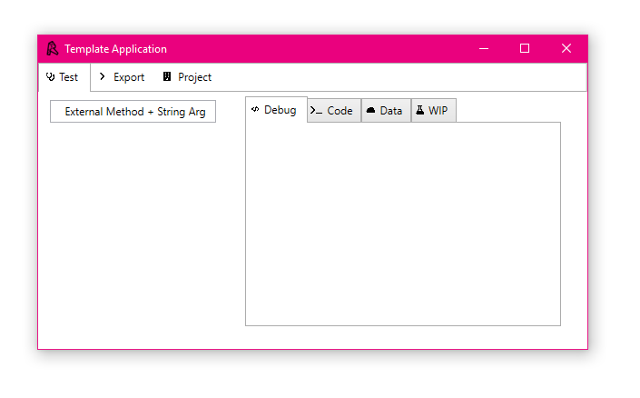
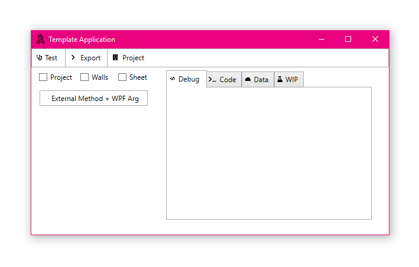
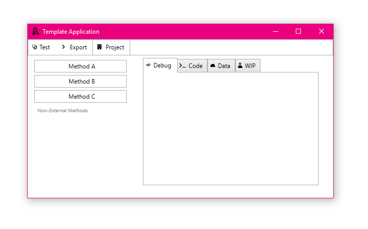
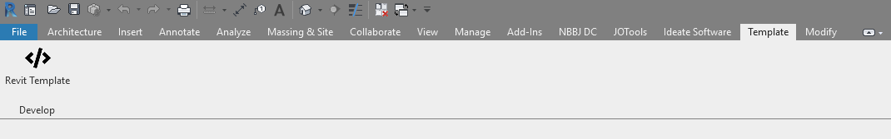

# Revit WPF Template

WPF Template for Revit Add-Ins including wrapped external methods for execution in a "Valid Revit API Context"

## Usage

### Build

1. Clone/download this repository and open the `.sln` at the root of the repository with Microsoft Visual Studio.
2. `Install-Package DynamicLanguageRuntime -Version 1.1.0`
3. Re-link references to `RevitAPI.dll` and `RevitAPIUI.dll` and any others which may be missing. 
4. Build the solution - Building the solution will automatically create and copy the add-in files to the folder for Revit 2019.
5. Open Revit - Upon opening Revit 2019, there should be a tab called "Template" in Revit, with a button to launch the WPF add-in.

### Customize

In order to use this as a starter for your application, make sure you first refactor the content in the application files (namespace, assembly name, classes, GUID, etc.) and remove the [assets](/assets) folder in this repository.

A guide to refactoring can be found in the [docs](/docs/RefactorInstructions.md) folder.

## Documentation

Documentation is created using [Sandcastle Help File Builder](https://github.com/EWSoftware/SHFB) by compiling the docstrings from the compiled `.dll` and `.xml` files generated by Visual Studio upon build. The Sandcastle project can be launched through the [`RevitTemplate.shfbproj`](/docs/RevitTemplate.shfbproj) file in the `docs` folder.

The documentation can be found in the [docs](/docs) folder in the root of this repository. The following documentation sources are created by [Sandcastle Help File Builder](https://github.com/EWSoftware/SHFB):

1. [`.chm`](./docs/Help/Revit%20WPF%20Template%20Documentation.chm) - This is an interactive help file which can be launched by double-clicking on any Windows machine.
2. [`index.html`](./docs/Help/index.html) - This is the documentation compiled for web deployment. Please note that many of the supporting files needed to deploy the documentation to the web have been git-ignored due to their size and count. Make sure to compile documentation yourself using [Sandcastle Help File Builder](https://github.com/EWSoftware/SHFB) prior to trying to use/deploy the web version of the documentation. A preview of what this looks like can be [found here](https://revit-wpf-template-docs.now.sh).
